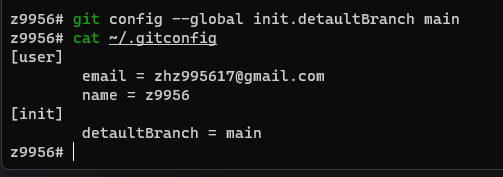

## Table of Contents

1. [git sparse checkout](#sparse-checkout)
2. [git detaultBranch](#detaultBranch)

##

## <span id='sparse-checkout'>git sparse checkout</span>

```shell
#建立一个空的版本库
git init <project>

#添加远程库的地址
git remote add origin https://*****.git

#打开sparse checkout功能
git config core.sparsecheckout true

#设置要克隆的仓库的子目录路径、添加目录到checkout的列表
echo "path1/" >> .git/info/sparse-checkout

#拉取远程的分支
git pull origin [branch]
```

**[⬆ back to top](#table-of-contents)**

## <span id='detaultBranch'>git detaultBranch</span>

```shell
git config --global init.detaultBranch main

#查看是否设置成功
cat ~/.gitconfig
```



**[⬆ back to top](#table-of-contents)**
